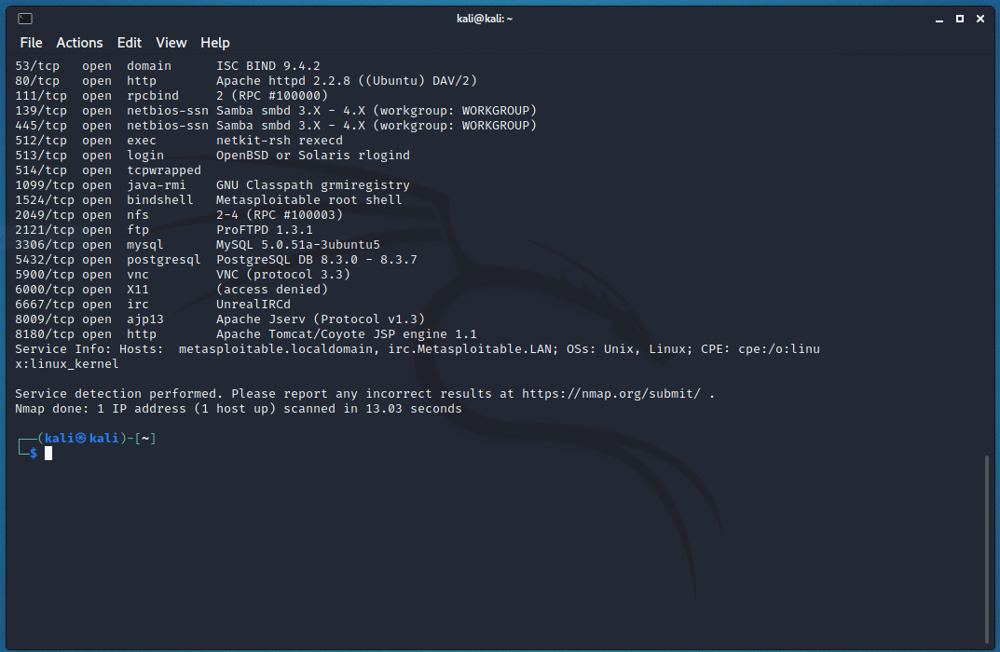
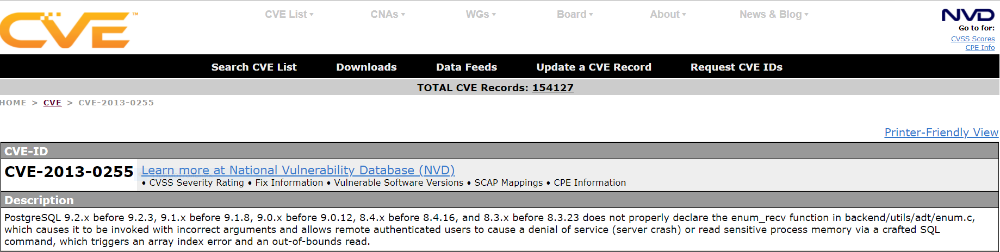
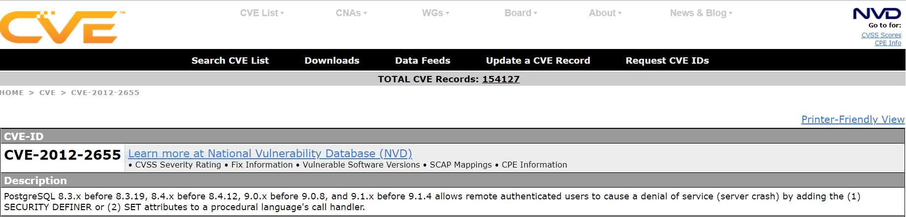
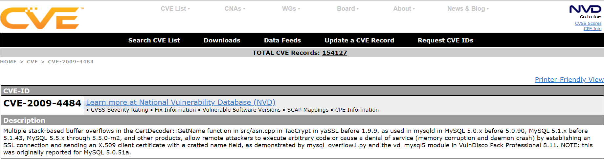
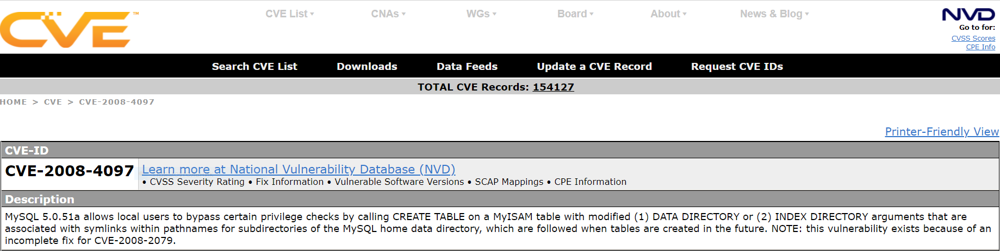
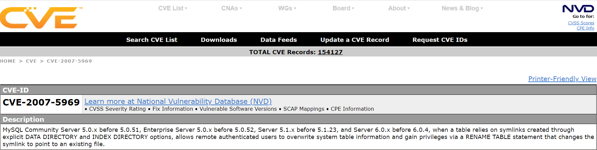
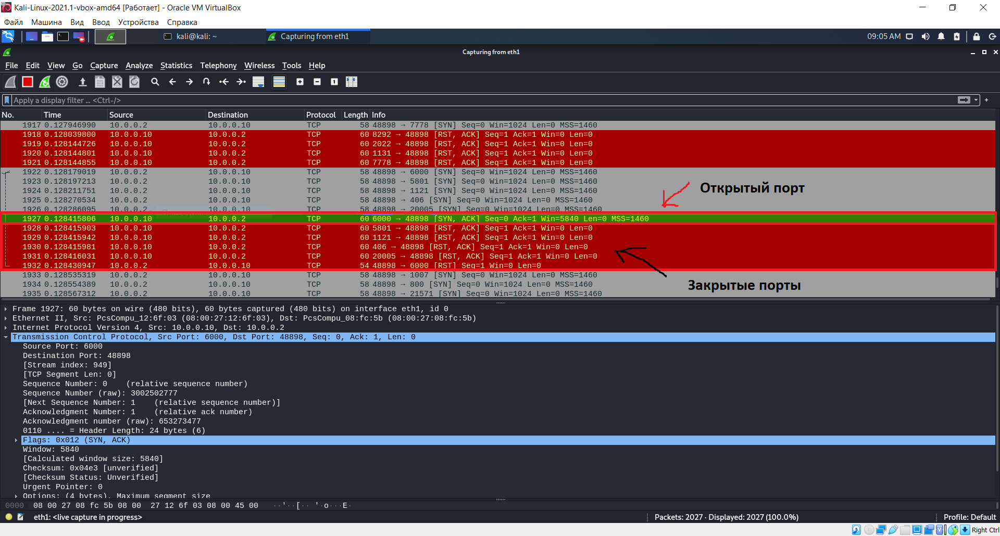
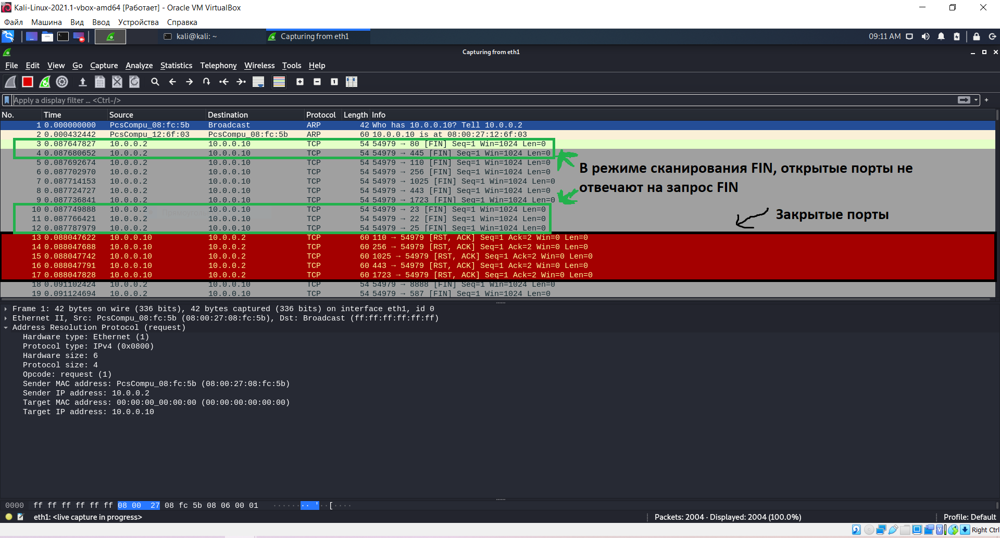
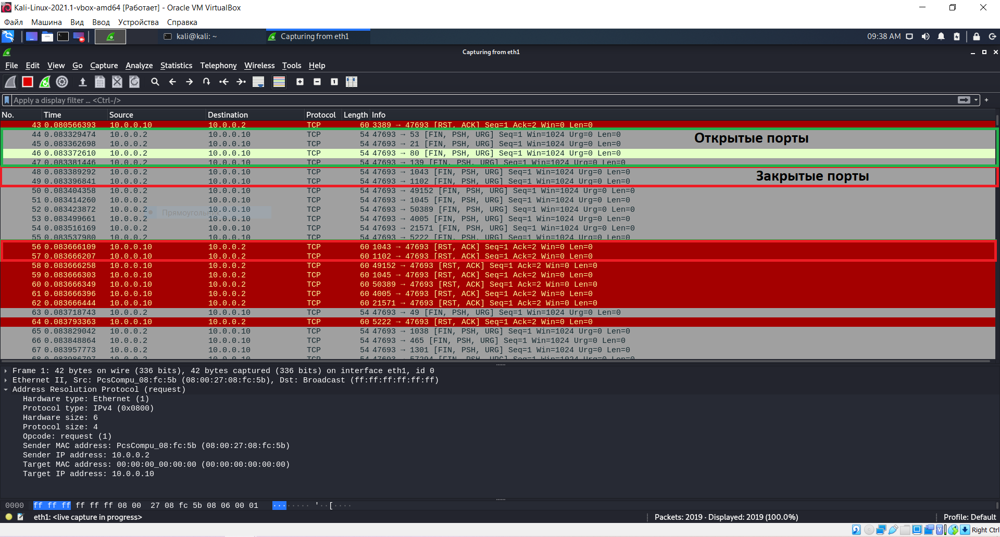
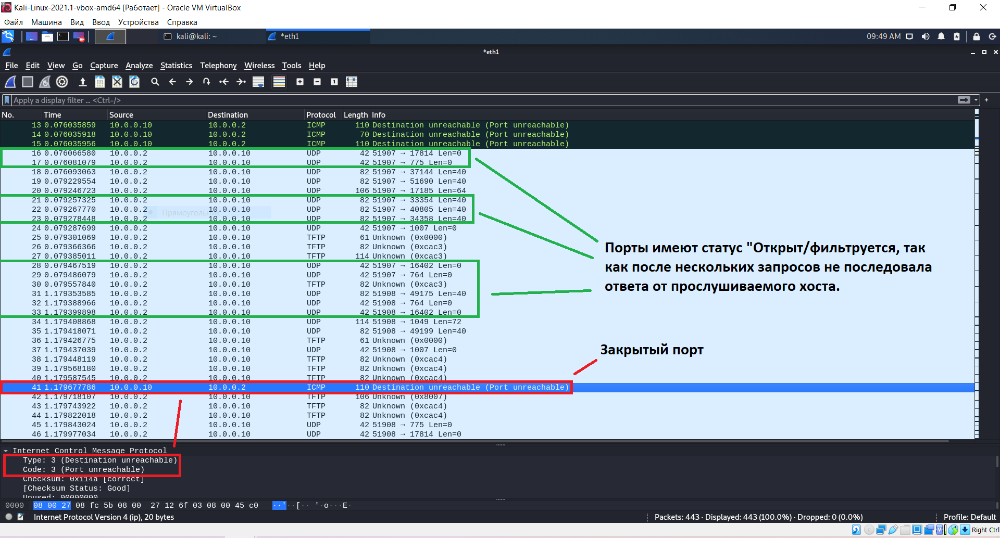

# Задание "Metasploitable"

### 1. Какие сетевые службы в ней разрешены?

### 1. Какие уязвимости были вами обнаружены (список со ссылками)

* http://cve.mitre.org/cgi-bin/cvename.cgi?name=CVE-2013-0255

* http://cve.mitre.org/cgi-bin/cvename.cgi?name=CVE-2012-2655

* http://cve.mitre.org/cgi-bin/cvename.cgi?name=CVE-2009-4484

* http://cve.mitre.org/cgi-bin/cvename.cgi?name=CVE-2008-4097

* http://cve.mitre.org/cgi-bin/cvename.cgi?name=CVE-2007-5969

# Задание "SYN, FIN, Xmas, UDP"

* SYN метод, основанный на принципах создания TCP-соединения и состоящий в последовательной передаче на объект сканирования TCP SYN-запросов на создание соединения на различные порты. Если порт открыт, то на данный сканирующий запрос будет получен ответ TCP SYN АСК; если же порт закрыт - ответом будет TCP RST.

* FIN в основу данного метода легли некоторые тонкости реализации протокола TCP в различных сетевых ОС: на передаваемый TCP FIN-запрос закрытые порты отвечают пакетом с флагом RST, а открытые порты данное сообщение игнорируют. Однако сетевые ОС фирмы Microsoft таким методом просканировать не удастся, так как в их реализации протокола TCP передача пакета TCP RST в ответ на подобный запрос не предусмотрена.

* Xmas если в ответ приходит RST пакет, то порт считается закрытым, отсутствие ответа означает, что порт открыт|фильтруется. Порт помечается как фильтруется, если в ответ приходит ICMP ошибка о недостижимости (тип 3, код 1, 2, 3, 9, 10 или 13).

* UDP сканирование работает путем посылки пустого (без данных) UDP заголовка на каждый целевой порт. Если в ответ приходит ICMP ошибка о недостижимости порта (тип 3, код 3), значит порт закрыт. Другие ICMP ошибки недостижимости (тип 3, коды 1, 2, 9, 10 или 13) указывают на то, что порт фильтруется. Иногда, служба будет отвечать UDP пакетом, указывая на то, что порт открыт. Если после нескольких попыток не было получено никакого ответа, то порт классифицируется как открыт|фильтруется. Это означает, что порт может быть открыт, или, возможно, пакетный фильтр блокирует его.

